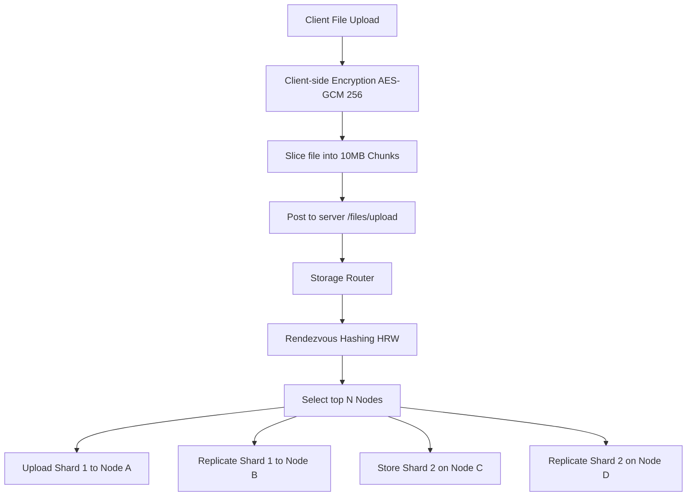

# Architecture

This document describes the high-level architecture of **Zancrypt (YuuVault)**.

## Overview

Zancrypt is designed to resolve traditional cloud storage concerns (single point of failure, data exposure, provider trust requirements) through a zero-knowledge, distributed architecture. 

The architecture is composed of a decoupled web client, a highly concurrent server API, and a distributed network of storage nodes.

## High-Level Flow

## Technology Stack

### web Architecture
- **Core**: React 19 (Single Page Application) initialized and compiled using **Vite**.
- **Styling**: **TailwindCSS v4** with a highly customized theme, utilizing glassmorphic layouts and dark mode parameters.
- **Animations**: **GSAP** combined with `ScrollTrigger` and `MotionPathPlugin` and **Framer Motion** for transitions.
- **State Management**: **Zustand** for lightweight, reactive client-side store systems.
- **Data Fetching**: **Axios** and **TanStack React Query** for server-state synchronization.
- **Visualizations**: **Recharts** for plotting real-time node loads, latencies, and storage volumes on dashboards.
- **WebAuthn API**: `@github/webauthn-json` for easy serialization and deserialization of raw binary credentials.
- **Decoders**: `heic-to` dynamically imported WASM HEIC-to-JPEG decoder.

### server Architecture
- **Core Framework**: **FastAPI** (Python 3.12) utilizing asynchronous routes (`async def`).
- **Database ORM**: **SQLAlchemy 2.0** with **asyncpg** (PostgreSQL driver) for non-blocking database communication.
- **Migrations**: **Alembic** for managing database schema evolution.
- **Asynchronous Tasks**: **Celery** with **Redis** as a message broker for heavy processing tasks.
- **Security & Auth**: `fido2` library for FIDO2 verification, `passlib` / `bcrypt`, and `python-jose` for JWT tokens.
- **Cloud Integrations**: `aioboto3` for non-blocking multipart file uploads to S3-compatible cloud interfaces.

### Infrastructure & Telemetry
- **OpenTelemetry Tracking**: Traces FastAPI routes for performance profiling.
- **Immutable Auditing**: Audit logs are generated for all critical events.
- **Docker**: Containerized deployment with Nginx as a reverse proxy for edge routing.
