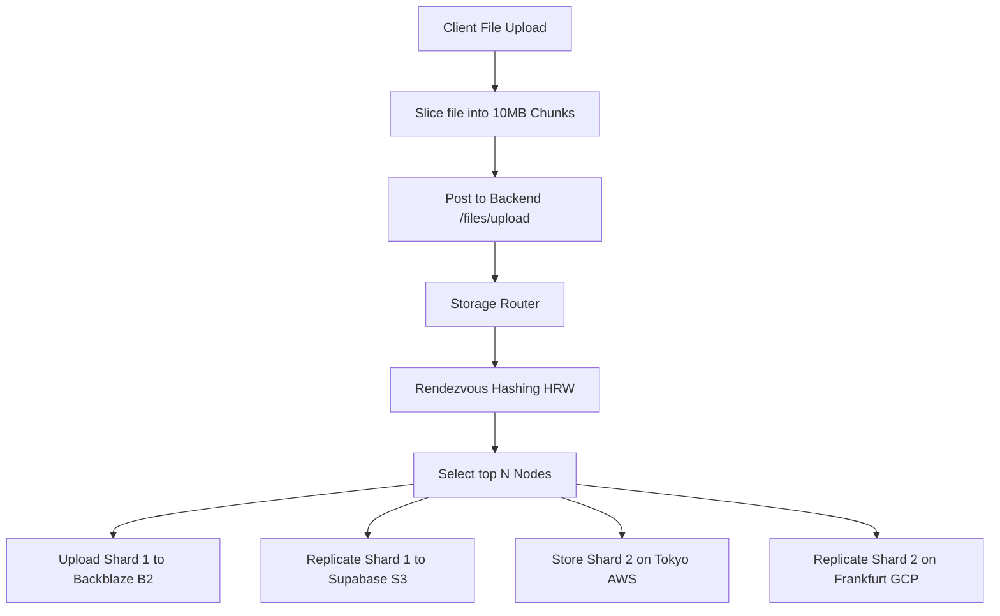

# Features and Technology Documentation: Zancrypt

This document provides a comprehensive technical guide to the features, architectural design, technologies, and implementation details of the **Zancrypt** zero-knowledge distributed secure file storage platform.

---

## 1. Architectural Philosophy & Goals

Zancrypt is designed to resolve traditional cloud storage concerns (single point of failure, data exposure, provider trust requirements) through three main pillars:
*   **Zero-Knowledge Authentication & Key Management**: User identities are anchored in hardware biometrics (FIDO2/WebAuthn), and encryption keys are derived client-side. The backend server never receives, stores, or processes cleartext encryption keys or raw passwords.
*   **Distributed Shard Architecture**: Files are not stored as single units. Instead, they are chunked into shards, encrypted, and distributed globally across multiple independent storage clouds (e.g., Backblaze B2, Supabase S3) using priority routing and replication.
*   **Self-Custody & Expiring Containers**: Files can be compiled into zero-dependency, self-contained HTML envelopes that self-destruct locally on opening, safeguarding file delivery from middleman interception.

---

## 2. Technology Stack & Directory Layout

### Frontend Architecture
*   **Core**: React 19 (Single Page Application) initialized and compiled using **Vite**.
*   **Styling**: **TailwindCSS v4** with a highly customized theme, utilizing glassmorphic layouts, dark mode parameters, and responsive design systems.
*   **Animations**: **GSAP** (GreenSock) combined with `ScrollTrigger` and `MotionPathPlugin` (for animated telemetry data paths on maps) and **Framer Motion** (for page transitions, loading states, and modal overlays).
*   **State Management**: **Zustand** for lightweight, reactive client-side store systems (managing active file state, node lists, and metrics).
*   **Data Fetching**: **Axios** and **TanStack React Query** for server-state synchronization.
*   **Visualizations**: **Recharts** for plotting real-time node loads, latencies, and storage volumes on dashboards.
*   **WebAuthn API**: `@github/webauthn-json` for easy serialization and deserialization of raw binary credentials between browser WebAuthn API and JSON payloads.
*   **Decoders**: `heic-to` dynamically imported WASM HEIC-to-JPEG decoder for in-browser client-side preview of iPhone photographs.

### Backend Architecture
*   **Core Framework**: **FastAPI** (Python 3.12) utilizing asynchronous routes (`async def`).
*   **Database ORM**: **SQLAlchemy 2.0** with **asyncpg** (PostgreSQL driver) for non-blocking database communication.
*   **Migrations**: **Alembic** for managing database schema evolution.
*   **Asynchronous Tasks**: **Celery** with **Redis** as a message broker for heavy processing tasks.
*   **Security & Auth**:
    *   `fido2` library for FIDO2 registration options and verification ceremonies.
    *   `cryptography` library for helper functions.
    *   `passlib` and raw `bcrypt` for user key verification.
    *   `python-jose` for generating and verifying JSON Web Tokens (JWT).
*   **Cloud Integrations**: `aioboto3` (Asynchronous Boto3 wrapper) for non-blocking multipart file uploads to S3-compatible cloud interfaces.

### Deployment & Infrastructure
*   **Docker & Docker Compose**: Configures a multi-container network:
    *   `db`: PostgreSQL 15 Alpine container.
    *   `redis`: Redis 7 Alpine container.
    *   `backend`: Python 3.12 FastAPI ASGI server.
    *   `worker`: Celery background task worker.
    *   `frontend`: Nginx alpine container hosting the compiled React SPA files.
    *   `nginx`: Edge reverse proxy routing `/auth`, `/files`, and `/api` requests to the backend, and static file requests to the frontend.

---

## 3. Cryptographic Security & Zero-Knowledge System

### A. Zero-Knowledge Hardware Identity (FIDO2 / WebAuthn)
Rather than relying on usernames and passwords sent over the network, Zancrypt implements hardware-bound biometric authentication:
1.  **Registration Initiation (`/auth/register/start`)**:
    *   The backend retrieves FIDO2 credential descriptors and challenges via the Python `fido2` library.
    *   A state payload containing the email, display name, and generated challenge is stored in Redis under a short-lived `session_id`.
2.  **Biometric Ceremony (Frontend)**:
    *   The frontend uses `@github/webauthn-json` to call the browser's native `navigator.credentials.create()`.
    *   The user authorizes using FaceID, TouchID, Windows Hello, or a YubiKey.
3.  **Registration Verification (`/auth/register/verify`)**:
    *   The client sends the signed attestation back along with an `access_key` and a client-side generated `master_key_salt`.
    *   The backend verifies the challenge signature.
    *   The `access_key` is hashed using SHA-256 (to bypass bcrypt's 72-byte restriction) and then hashed using `bcrypt` to be stored in the database under `identity_verifier` for fallback authentication.
    *   A `WebAuthnCredential` model stores the public key and sign count.
4.  **Fallback Login (`/auth/login/fallback`)**:
    *   If biometric authentication is unavailable, the user can type their `access_key`.
    *   The client sends the key, and the server validates it against `identity_verifier` via `bcrypt.checkpw()`.

### B. Client-Side Cryptography (Web Crypto API)
To enforce absolute privacy, file contents are processed using the browser's Web Crypto API:
*   **Key Derivation**: High-entropy keys are derived from the user's master key and the stored `master_key_salt` using **PBKDF2** (using 100,000 iterations and SHA-256 hashing).
*   **Encryption Scheme**: Files are encrypted client-side using **AES-GCM 256** with a randomly generated 12-byte Initialization Vector (IV).
*   **Metadata Shielding**: File names and types are encrypted on the client and stored as ciphertext (`encrypted_filename`, `encrypted_metadata`), preventing metadata leaks.

### C. Client-Side Processing & Decryption Previews
*   **WASM HEIC Translation**: If the user uploads a `.HEIC` image (common in iOS devices), the preview window uses a WASM module (`heic-to`) in-browser to translate the raw decrypted HEIC blob into standard JPEG before rendering, avoiding backend processing.
*   **Apple MOV Decoding**: Custom MIME-mapping converts `.mov` containers to `video/quicktime` to enable HTML5 playback of decrypted iPhone video captures natively in Safari and Chrome engines.

---

## 4. Distributed Shard Storage Engine

### A. Sharding (Chunking)
*   To bypass size constraints on server memory and storage API limitations (e.g., Supabase 50MB request caps), files are sliced into **10MB chunks** (shards) in the browser using the JavaScript `file.slice()` API.
*   The shards are transmitted inside a single multipart/form-data upload request containing a `manifest` mapping the files.

### B. Rendezvous Hashing (Highest Random Weight Hashing)
To distribute shards without maintaining a centralized mapping of nodes, the backend implements Rendezvous Hashing in `app/storage/routing.py`:
$$\text{Score}(S, N) = \text{SHA256}(S \mathbin{\Vert} N)$$
For each shard:
1.  A score is calculated for each healthy node by hashing the concatenation of the `shard_id` and the `node_name`.
2.  Nodes are sorted in descending order of their score.
3.  The top $N$ nodes (configured via `replication_factor`, default = 2) are selected to receive the shard.

### C. Failover & Health Checks
*   When downloading a file, the `StorageRouter` requests the manifest, identifies the target nodes, and attempts to fetch each shard from the primary node.
*   If the primary node is offline (healthy = False in the registry), the router automatically attempts to download the shard from secondary replica nodes (failover).

### D. Transactional DB & Physical Shard Rollbacks
To prevent orphaned files and database corruption:
*   Physical shard uploads to cloud platforms (Backblaze B2, Supabase) are coordinated concurrently using `asyncio.gather`.
*   If a shard upload fails on all target replica nodes, the backend triggers an emergency cleanup: it deletes all successfully uploaded shards for that request from cloud storage and rolls back the database transaction.

---

## 5. Self-Destructing HTML Wrappers

Zancrypt includes a sharing protocol that wraps file payloads inside secure, self-destructing HTML files (`app/services/wrapper_generator_service.py`):

1.  **Obfuscation**:
    *   The server derives a key by hashing the share token (`SHA-256`).
    *   The file bytes are obfuscated using a repeating byte-by-byte **XOR** operation against this key to obscure them from basic inspect tools or search engine crawlers.
2.  **Self-Contained Countdown**:
    *   The generated HTML page contains a visual countdown timer (configurable to 1h, 6h, 24h, 72h).
    *   Upon expiration, or if a clock rollback is detected (`now < lastTick - 2000`), the page triggers memory scrubbing: it nullifies all variables containing the base64-encoded payload and marks the ID as destroyed in browser `localStorage`.
3.  **Destruction Telemetry**:
    *   When self-destruction triggers, the client triggers a non-blocking `navigator.sendBeacon` request back to `/api/share/destroyed` to inform the backend, which registers the event in the audit system.

---

## 6. Observational Telemetry & Monitoring

*   **Immutable Auditing**: Every critical event (e.g., `upload`, `download`, `share_create`, `wrapper_generated`, `soft_delete`, `restore`) is written to the `audit_logs` table.
*   **Security Alerting**: Actions matching suspicious behavior (e.g., multiple invalid attempts, database changes) trigger a `SecurityEvent` log with severity rankings (`low` to `critical`).
*   **Structured Logs**: The application uses `python-json-logger` to format log messages as JSON strings, passing context attributes (such as `user_id`, `file_id`, and `action`) for processing by external log engines.
*   **OpenTelemetry Tracking**: The system integrates the OpenTelemetry SDK to instrument FastAPI routes, enabling performance profiling and connection latency tracing.
*   **Metrics calculations**: Dynamic background metrics calculate storage utilization and node health metrics to scale dashboard charts.
